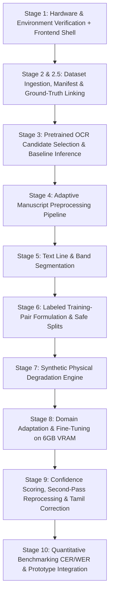

# Project Execution Plan & Research Roadmap

## Project: Distortion-Aware Tamil Palm-Leaf Manuscript OCR / HTR System
**Target Hardware:** NVIDIA GeForce RTX 4050 Laptop GPU (6 GB VRAM) | 16 GB System RAM | Windows 10/11 | Python 3.11

---

## 1. Research Objective & Principles

* **Core Premise:** The objective is **not** to invent a novel deep learning OCR architecture from scratch. We adapt existing open-source Indic/Tamil OCR/HTR models to degraded historical Tamil palm-leaf manuscripts.
* **Ground Truth Integrity:** A binarized or preprocessed image is *not* a text ground truth. Ground truth is strictly `(image_crop -> Unicode Tamil string)`. Missing values and non-ground-truth data must never be fabricated.
* **Leakage-Safe Partitioning:** Data splits (Train / Val / Test) must occur at the **manuscript / folio / document level**, ensuring that different versions (raw vs. binarized), duplicate folios, or synthetic variants of the same manuscript never appear across split boundaries.

---

## 2. Staged Roadmap

---

### STAGE 1 — Environment + GPU Verification & Frontend Foundation (Current)
* **Tasks:**
  * Configure CUDA 12.4 enabled PyTorch in `.venv`.
  * Validate GPU device recognition (`RTX 4050`) and VRAM tensor allocation.
  * Define `requirements.txt` with foundational libraries.
  * Build 9-page historical manuscript digitization frontend prototype with clean mock service interfaces.
* **Outputs:** Verified CUDA environment, [requirements.txt](file:///C:/Users/vaish/tamil_palm_ocr/requirements.txt), [README.md](file:///C:/Users/vaish/tamil_palm_ocr/README.md), [PROJECT_PLAN.md](file:///C:/Users/vaish/tamil_palm_ocr/PROJECT_PLAN.md), `app/frontend/`.

---

### STAGE 2 — Dataset Inspection, Ingestion & Manifest Formulation
* **Tasks:**
  * Safely extract root raw archives (`Naladiyar.zip`, `THIRIKADUGAM.zip`, `THOLKAPPIYAM BINARIZED - (2).zip`) into `data/raw/thplmd/` without altering source archives.
  * Structure CICT metadata into `data/raw/cict/`.
  * Analyze image dimensions, color profiles, resolution, binarization status, and folio relationships.
  * Generate machine-readable `dataset_manifest.csv` and `dataset_manifest.json` under `data/annotations/metadata/`.
* **Outputs:** Complete dataset catalog with verified counts and provenance.

---

### STAGE 2.5 — Ground-Truth Linking & CICT Image Fetch
* **Tasks:**
  * Resolve and download the high-resolution IIIF image for `CICT-PLM-GT-133` from Zenodo into `data/raw/cict/`.
  * Parse `CICT-PLM-GT-133.xml` (PAGE XML format) and extract line polygons, baselines, and exact Tamil transcriptions.
  * Formulate initial validated `(line_image_crop, ground_truth_text)` reference benchmark.
* **Outputs:** Verified line-level ground-truth pairs for Tirukkural Chapter 133.

---

### STAGE 3 — OCR Model Selection & Zero-Shot Baseline Inference
* **Tasks:**
  * Evaluate open-source Tamil OCR/HTR candidates (e.g., Indic TrOCR, EasyOCR Tamil, Tesseract Indic, CTC-based Tamil models).
  * Run zero-shot baseline inference on raw vs. binarized manuscript images.
  * Quantify initial baseline CER and WER on available ground truth.
* **Outputs:** Baseline benchmark log in `results/metrics/baseline.json`.

---

### STAGE 4 — Adaptive Manuscript Preprocessing Pipeline
* **Tasks:**
  * Implement modular preprocessing components in `src/preprocessing/`:
    * Multi-scale background/illumination normalization.
    * Adaptive thresholding (Sauvola, Niblack, Otsu, Bradley).
    * Edge-preserving denoising (Bilateral filtering, Non-Local Means).
    * Contrast stretching (CLAHE).
    * Deskewing via Radon/Hough transform.
  * Systematically measure the effect of individual and chained preprocessing steps on OCR character recognition.
* **Outputs:** Parameterized preprocessing pipeline with preset variants (Faint Stroke, Heavy Staining, High Contrast).

---

### STAGE 5 — Text Line & Band Segmentation
* **Tasks:**
  * Implement horizontal projection profile and connected-component line extractors suited for long aspect-ratio palm leaves.
  * Support reading order preservation and polygon bounding-box exports.
  * Provide fallback manual adjustment coordinates for irregular manuscript folios.
* **Outputs:** Segmented line crops stored in `data/processed/line_crops/`.

---

### STAGE 6 — Training-Pair Preparation & Leakage-Safe Splits
* **Tasks:**
  * Aggregate all verified line-level image-text pairs into structured datasets.
  * Partition into `train.jsonl`, `val.jsonl`, and `test.jsonl` under `data/splits/`.
  * Guarantee zero document/folio overlap between training and test sets.
* **Outputs:** Partitioned datasets ready for fine-tuning.

---

### STAGE 7 — Synthetic Palm-Leaf Degradation Engine
* **Tasks:**
  * Generate realistic synthetic manuscript training data from clean Tamil text/fonts.
  * Apply physical degradation modeling:
    * Palm-leaf texture blending and fibrous background synthesis.
    * Ink fading, stroke erosion, and ink bleeds.
    * Physical scratches, wormholes, and edge tears.
    * Non-uniform lighting gradients and perspective distortion.
* **Outputs:** Synthetic dataset in `data/synthetic/` with deterministic random seeds.

---

### STAGE 8 — Model Domain Adaptation & Fine-Tuning (6 GB VRAM)
* **Tasks:**
  * Fine-tune selected OCR/HTR architecture using PyTorch with:
    * Mixed precision (`torch.cuda.amp.autocast`).
    * Gradient accumulation to maintain effective batch sizes.
    * Gradient checkpointing if necessary.
  * Compare training stages: Pretrained -> Synthetic Augmented -> Real Palm-Leaf.
* **Outputs:** Trained checkpoint in `models/checkpoints/` and final model weights in `models/final/`.

---

### STAGE 9 — Confidence-Based Second-Pass & Tamil Post-Correction
* **Tasks:**
  * Extract token-level softmax confidence / predictive entropy from the OCR model.
  * Route low-confidence lines through alternative preprocessing pipelines and re-evaluate.
  * Implement conservative rule-based Tamil orthographic post-correction (Unicode normalization, pulli dot restoration, vowel sign consistency).
* **Outputs:** Two-pass inference engine in `src/confidence/` and `src/correction/`.

---

### STAGE 10 — Final Evaluation & Interactive Application Integration
* **Tasks:**
  * Compute final CER and WER benchmarks comparing Raw vs. Preprocessed vs. Fine-tuned vs. Second-Pass pipelines.
  * Connect the Python FastAPI/PyTorch inference server to the interactive frontend.
  * Enable live manuscript upload, line inspection, confidence inspection, Tamil text editing, and digital text export.
* **Outputs:** Complete end-to-end digitization laboratory and research report.
