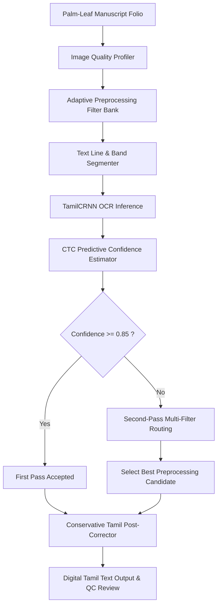

# System Architecture & Technical Specification

> **Research Contribution:**
> *This project adapts an existing Tamil OCR model (`TamilCRNN`, 53.79M parameters) to degraded palm-leaf manuscript imagery; it does NOT introduce a new OCR architecture.*

---

## 1. End-to-End Pipeline Workflow

---

## 2. Core Modules

1. **Preprocessing (`src/preprocessing/`):**
   - Modular filter bank: Grayscale, CLAHE contrast equalization, bilateral denoising, Sauvola adaptive binarization, morphological illumination background division.
2. **Segmentation (`src/segmentation/`):**
   - Horizontal projection profile (HPP) with Gaussian smoothing and valley detection to slice long aspect-ratio palm-leaf folios into line crops.
3. **Synthetic Physics Degradation (`src/augmentation/`):**
   - Realistic palm-leaf texture blending, ink fading, physical scratches, fibrous striations, and non-uniform illumination.
4. **OCR Architecture (`src/ocr/`):**
   - `TamilCRNN`: ResNet-VGG convolutional backbone + 2-layer Bidirectional LSTM (`hidden_size=512`) + 143-class CTC projection head (53,791,855 parameters).
5. **Confidence Routing (`src/confidence/`):**
   - True CTC token probability and sequence entropy estimation with closed-loop multi-filter routing.
6. **Tamil Post-Correction (`src/correction/`):**
   - Strictly conservative Unicode NFC normalization, combining sign re-attachment, and virama de-duplication without word hallucination.
7. **REST Backend & Frontend (`src/api/` & `app/frontend/`):**
   - FastAPI backend service with Vite React frontend interface for upload, line-level inspection, live OCR, and TXT/JSON export.
