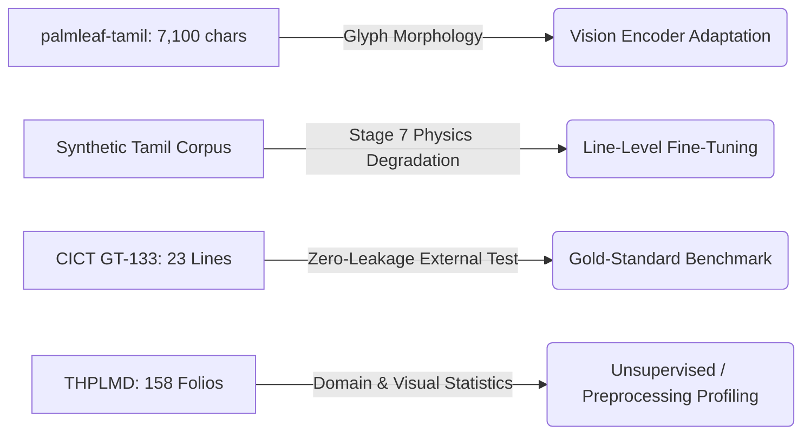

# Dataset Provenance, Organization & Manifest

## 1. Overview of Manuscript Corpora

| Dataset | Provenance / Collection | Local Status | Total Items | Granularity | Ground-Truth Transcriptions | Split Assignment | License |
| :--- | :--- | :--- | :--- | :--- | :--- | :--- | :--- |
| **CICT-PLM-GT-133** | Central Institute of Classical Tamil (CICT) | Present | 1 Folio / 23 Line Crops | `LINE_LEVEL` | Aligned PAGE XML (10 couplets + 3 headers + 10 numerals) | `external_test.jsonl` (Gold Standard) | CC BY 4.0 |
| **THPLMD - Naladiyar** | Tamil Palm-Leaf Manuscript Dataset | Present (Staging) | 53 Folios | `FOLIO_LEVEL` | Unlabeled (`UNLABELED`) | `unlabeled_pool.jsonl` | Academic Research |
| **THPLMD - Thirikadugam**| Tamil Palm-Leaf Manuscript Dataset | Present (Staging) | 24 Folios | `FOLIO_LEVEL` | Unlabeled (`UNLABELED`) | `unlabeled_pool.jsonl` | Academic Research |
| **THPLMD - Tholkappiyam** | Tamil Palm-Leaf Manuscript Dataset | Present (Staging) | 81 Folios | `FOLIO_LEVEL` | Unlabeled (`UNLABELED`) | `unlabeled_pool.jsonl` | Academic Research |
| **palmleaf-tamil** | Kaggle Palm-Leaf Tamil Character Dataset | Present (`palmleaf-tamil.rar`) | 7,100 Character Crops | `CHARACTER_LEVEL` | Class ID Labels (71 classes, 100/class) | `character_pool.jsonl` | Open-Access / CC |
| **IIIT Tamil Handwriting**| IIIT-H Indic Handwriting Corpus | Unavailable locally | 0 | `WORD_LEVEL` | Awaiting local hosting | Awaiting / Offline | N/A |

---

## 2. Immutable Raw Data Policy

Everything stored under `data/raw/` is treated as **strictly immutable**:
* Never rename, overwrite, modify, or delete raw archive files.
* Extractions are executed cleanly into designated staging directories without mutating original archives.
* Raw metadata files (`CICT-PLM-GT-133.json` and `CICT-PLM-GT-133.xml`) retain original encoding and provenance headers.

---

## 3. Detailed Dataset Roles in OCR Architecture

1. **`CICT-PLM-GT-133` (Level 3 - Gold Standard Evaluation Benchmark):**
   * High-resolution IIIF folio ($2762 \times 459\text{ px}$) from Zenodo DOI `10.5281/zenodo.21337086`.
   * 23 verified line crops in `data/processed/cict_gt133_lines/` with authoritative PAGE XML transcription.
   * Locked exclusively to `external_test.jsonl` to prevent intra-folio leakage.

2. **`palmleaf-tamil` (Level 2 - Character Morphology Pool):**
   * 7,100 isolated Tamil palm-leaf glyph PNGs across 71 classes (100 samples/class).
   * Used for isolated character classification, vision backbone pre-adaptation, and glyph sampling in synthetic line rendering.

3. **`THPLMD` (Level 5 - Unlabeled Manuscript Pool):**
   * 158 full-folio images ($3996 \times 600\text{ px}$) across Naladiyar (53), Thirikadugam (24), and Tholkappiyam (81).
   * 46 candidate line crops extracted in Stage 5. Classified strictly as `UNLABELED` / `AUTOMATICALLY_SEGMENTED`.

4. **`IIIT Tamil Handwriting`:**
   * Not available locally. Documented as external/awaiting; no fabricated entries.

---

## 4. Leakage-Safe Splitting Policy

All data partitioning is controlled by the `SplitManager` in `src/data/splits.py`:
* **Folio-Level `source_group_id` Isolation:** Guarantees zero document or scribe overlap between training, validation, and testing partitions.
* **Paired Image Consistency:** Original and binarized versions of the same folio remain locked into the same split.
* **Unified Manifest:** All 7,327 cataloged items are tracked in `data/splits/unified_manifest.csv`.
