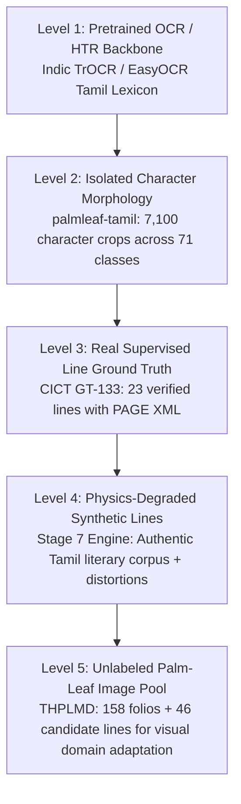

# Stage 6: Training-Pair Formulation, Dataset Integration & Leakage-Safe Splits

**Module:** `src/data/`  
**Manifest:** `data/splits/unified_manifest.csv`  
**Summary:** `results/metrics/dataset_hierarchy_summary.json`  
**Duplicate Audit:** `results/metrics/duplicate_report.csv`  

---

## 1. Scientific Data Hierarchy

To ensure rigorous, reproducible training without data leakage or label contamination, all data sources in the project are organized into five strict tiers:

### Level Roles & Usage Policies:
1. **Level 1 (Pretrained Foundation):** Standard pretrained weights (`Indic TrOCR` / `EasyOCR Tamil`) adapted to Tamil character vocabulary.
2. **Level 2 (Character Morphology):** Isolated palm-leaf characters (`palmleaf-tamil`) used for character classifier pretraining, vision encoder feature alignment, and synthetic line rendering. Kept distinct from continuous sequence OCR evaluation.
3. **Level 3 (Real Supervised Line Pairs):** Authoritative gold-standard line crops (`CICT GT-133`). Evaluated strictly as an **External Gold-Standard Test Set** (`external_test.jsonl`).
4. **Level 4 (Synthetic Palm-Leaf Lines):** Generated in Stage 7 by rendering authentic Tamil Unicode literature with physics-based palm-leaf degradation (texture, ink fading, striations, lighting gradients).
5. **Level 5 (Unlabeled Real Folios):** 158 full folios from THPLMD (Naladiyar, Thirikadugam, Tholkappiyam). Kept in `unlabeled_pool.jsonl` with explicit tag `UNLABELED`.

---

## 2. Leakage Prevention Protocol

### A. The `source_group_id` Isolation Invariant
Splitting at the crop or line level within the same manuscript folio causes severe test leakage (the model memorizes the specific scribe's handwriting, ink degradation, and leaf background).

To prevent this:
* Every sample is assigned an immutable `source_group_id` based on its physical manuscript folio identity:
  * `CICT_GT133_FOLIO_87`
  * `THPLMD_NALADIYAR_176`
  * `THPLMD_THIRIKADUGAM_461`
  * `THPLMD_THOLKAPPIYAM_351`
* **Invariant:** No `source_group_id` may ever appear in more than one partition (`train`, `val`, `test`, `external_test`).
* **Paired Image Rule:** Both original and binarized versions of the same folio share the identical `source_group_id` and are locked into the same split.

### B. CICT GT-133 Partitioning Policy
Because CICT GT-133 consists of 23 line crops sliced from **a single physical palm leaf** (Folio 87 Recto), creating an artificial 80/10/10 line-level split would introduce severe intra-folio leakage.

Therefore:
* **All 23 CICT lines are placed exclusively into `external_test.jsonl`.**
* CICT serves as the held-out gold-standard benchmark for zero-shot and fine-tuned OCR evaluation.

---

## 3. Unified Manifest Schema (`data/splits/unified_manifest.csv`)

The unified manifest catalogs **7,327 total dataset records**:

| Column Name | Type | Description / Allowed Values |
|---|---|---|
| `sample_id` | String | Globally unique sample identifier (e.g. `CICT_line_body_L1`, `THPLMD_Naladiyar_176`, `PLT_CHAR_1_001`) |
| `dataset` | String | Originating dataset (`CICT-PLM-GT-133`, `THPLMD`, `palmleaf-tamil`) |
| `collection` | String | Manuscript work (`Tirukkural`, `Naladiyar`, `Thirikadugam`, `Tholkappiyam`, `Isolated Character Set`) |
| `source_group_id` | String | Folio-level grouping ID for zero-leakage enforcement |
| `folio_id` | String | Physical leaf number (`87_Recto`, `176`, `461`, `351`, `NOT_AVAILABLE`) |
| `line_id` | String | Line-level identifier or `NOT_AVAILABLE` |
| `image_path` | String | Relative filepath or virtual archive URI |
| `label_path` | String | Path to annotation source XML/CSV or `NOT_AVAILABLE` |
| `transcription` | String | Raw transcription text or `NOT_AVAILABLE` |
| `normalized_transcription`| String | Unicode NFC normalized Tamil text |
| `data_level` | Enum | `FOLIO_LEVEL`, `LINE_LEVEL`, `CHARACTER_LEVEL` |
| `label_status` | Enum | `VERIFIED_GROUND_TRUTH`, `AUTOMATICALLY_SEGMENTED`, `IMAGE_TEXT_PAIRED`, `UNLABELED` |
| `line_type` | String | `paragraph`, `heading`, `marginalia`, `full_folio`, `candidate_line`, `isolated_character` |
| `reading_order` | Integer| Sequence order within folio |
| `split` | Enum | `train`, `val`, `test`, `external_test`, `character_pool`, `unlabeled_pool` |
| `preprocessing_variant` | String | Preprocessing pipeline used (`raw_crop`, `clahe_hpp_crop`, `binarized_crop`) |
| `synthetic_variant` | String | Synthetic degradation recipe (`none` for real data) |
| `license` | String | Provenance and redistribution license |
| `notes` | String | Detailed provenance notes |

---

## 4. Current Split Summary

| Split File | Count | Data Level | Label Status | Primary Function |
|---|---|---|---|---|
| `data/splits/train.jsonl` | 0 | `LINE_LEVEL` | `SYNTHETIC` | Provisional (Ready for Stage 7 synthetic lines) |
| `data/splits/val.jsonl` | 0 | `LINE_LEVEL` | `SYNTHETIC` | Provisional (Ready for Stage 7 validation set) |
| `data/splits/test.jsonl` | 0 | `LINE_LEVEL` | `SYNTHETIC` | Provisional (Synthetic test partition) |
| `data/splits/external_test.jsonl` | **23** | `LINE_LEVEL` | `VERIFIED_GROUND_TRUTH` | **CICT GT-133 Gold-Standard Real Evaluation Benchmark** |
| `data/splits/character_pool.jsonl` | **7,100** | `CHARACTER_LEVEL` | `IMAGE_TEXT_PAIRED` | Isolated glyph morphology & synthetic renderer sampling |
| `data/splits/unlabeled_pool.jsonl` | **204** | `FOLIO_LEVEL` / `LINE_LEVEL` | `UNLABELED` / `AUTOMATICALLY_SEGMENTED` | THPLMD folios (158) & Stage-5 candidate crops (46) |

---

## 5. Duplicate & Provenance Audit Findings

Audit Report: [`results/metrics/duplicate_report.csv`](file:///C:/Users/vaish/tamil_palm_ocr/results/metrics/duplicate_report.csv)
* **Exact SHA-256 Binary Duplicates:** 6 groups (replicated candidate line segments in automatic line detection).
* **Paired Original / Binarized Collisions:** 30 pairs identified (e.g. `Naladiyar Original/126.jpg` vs `Naladiyar Binarized/126.jpg`).
* **Resolution:** Handled cleanly by unified `source_group_id` (`THPLMD_NALADIYAR_126`), guaranteeing original and binarized versions remain locked together and cannot cross-contaminate splits.
