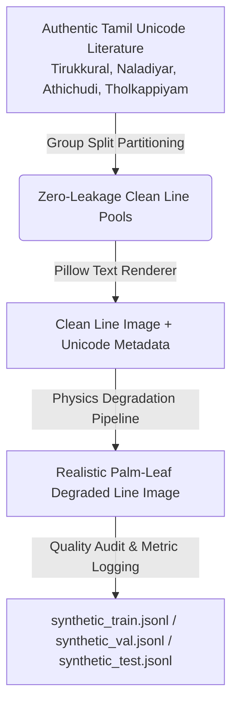

# Stage 7: Synthetic Palm-Leaf Manuscript Degradation Engine

**Modules:**  
- Clean Text Line Renderer: [`src/augmentation/text_renderer.py`](file:///C:/Users/vaish/tamil_palm_ocr/src/augmentation/text_renderer.py)  
- Physics-Inspired Degradation Engine: [`src/augmentation/palmleaf_degradation.py`](file:///C:/Users/vaish/tamil_palm_ocr/src/augmentation/palmleaf_degradation.py)  
- Synthetic Generator & Partitioner: [`src/augmentation/synthetic_generator.py`](file:///C:/Users/vaish/tamil_palm_ocr/src/augmentation/synthetic_generator.py)  
- Configuration: [`configs/synthetic_degradation.yaml`](file:///C:/Users/vaish/tamil_palm_ocr/configs/synthetic_degradation.yaml)  
- Visual Diagnostics: [`results/visualizations/synthetic/`](file:///C:/Users/vaish/tamil_palm_ocr/results/visualizations/synthetic/)  

---

## 1. Engine Objective & Scientific Rationale

Real palm-leaf manuscripts are severely scarce (CICT GT-133 contains 23 gold-standard lines, while THPLMD's 158 folios are currently unlabeled). Training deep sequence OCR/HTR models (such as Indic TrOCR) requires thousands of aligned text-image pairs.

Stage 7 implements a **physics-inspired, zero-leakage synthetic degradation engine** that renders authentic Tamil literature into clean line images and applies realistic historical palm-leaf physical degradations while preserving the exact ground-truth Unicode text label.

---

## 2. Authentic Tamil Text Corpus

* **Location:** [`data/corpus/tamil_literary_lines.json`](file:///C:/Users/vaish/tamil_palm_ocr/data/corpus/tamil_literary_lines.json)
* **License:** Public Domain / Classical Tamil Literature (CC0 / Open)
* **Source Works:**
  * **Tirukkural (திருக்குறள்):** Chapter 1 (*கடவுள் வாழ்த்து*, 20 lines)
  * **Naladiyar (நாலடியார்):** Classical 4-line moral verses (12 lines)
  * **Athichudi (ஆத்திசூடி):** Classical single-line aphorisms by Avvaiyar (12 lines)
  * **Tholkappiyam (தொல்காப்பியம்):** Classical grammar sutras from *நூல்மரபு* (6 lines)
* **Total Clean Lines:** 50 authentic classical lines across 16 source groups.
* **Normalization:** All lines normalized via Unicode NFC (`src/data/normalization.py`).

---

## 3. Modular Physical Degradation Operators

| Degradation Operator | Physics & Manuscript Phenomenon Modeled | Mathematical / Algorithmic Implementation |
|---|---|---|
| **1. Fibrous Background Texture** | Dried palm-leaf longitudinal veins, fiber grain, and brownish-ochre hue ($[215, 195, 160]$) | 1D frequency modulation + Gaussian striation noise blended with ink stroke masks |
| **2. Uneven Illumination** | Non-uniform ambient lighting, scanner shadows, and peripheral leaf darkening | Multi-pole linear, bilinear, and radial illumination gradient field multiplication |
| **3. Stroke Fading & Ink Wear** | Faint incisions, surface flaking, and loss of soot ink in fine loops | Morphological dilation erosion on inverted image + random alpha blending |
| **4. Stylus Scratches & Cracks** | Physical incisions, stylus drag marks, and longitudinal vein splits | Random directional antialiased line rendering along horizontal fiber angles ($\pm 15^\circ$) |
| **5. Speckles & Blemishes** | Oil stains, ink spatters, mold specks, and insect damage spots | Multi-radius circle splatter with varied luminance values |
| **6. Optical Blur & Sensor Noise** | Camera lens defocus, motion jitter, and CCD sensor grain | Gaussian filter ($\sigma \in [0.3, 2.0]$), 1D motion kernel, and additive Gaussian noise ($\sigma \in [2, 28]$) |
| **7. Geometric Tilt & Shear** | Physical leaf angle skew and perspective distortion | Affine rotation matrix ($\theta \in [-3.0^\circ, +3.0^\circ]$) with edge border replication |
| **8. Contrast Tuning** | Low optical contrast between incised soot and darkened leaf surface | Midpoint-centered luminance scaling ($f \in [0.40, 1.05]$) |

---

## 4. Degradation Presets & Parameter Ranges

| Preset Name | Target Phenomenon | Texture Strength | Blur $\sigma$ | Noise Std | Scratch Count | Speckle Count | Stroke Fading | Rotation |
|---|---|---|---|---|---|---|---|---|
| **`LIGHT`** | Mild aging, subtle grain | $0.15 - 0.25$ | $0.3 - 0.7$ | $2.0 - 5.0$ | $1 - 4$ | $2 - 6$ | False | $\pm 0.8^\circ$ |
| **`MEDIUM`** | Authentic typical leaf | $0.25 - 0.45$ | $0.5 - 1.1$ | $5.0 - 12.0$ | $3 - 8$ | $6 - 16$ | $p=0.5$ | $\pm 1.4^\circ$ |
| **`HEAVY`** | Severe weathering & fading | $0.40 - 0.65$ | $0.8 - 1.6$ | $10.0 - 20.0$ | $6 - 15$ | $12 - 30$ | True | $\pm 2.0^\circ$ |
| **`EXTREME`** | Near-illegible boundary | $0.60 - 0.85$ | $1.2 - 2.0$ | $16.0 - 28.0$ | $12 - 25$ | $25 - 50$ | True | $\pm 2.8^\circ$ |

---

## 5. Zero-Leakage Corpus Partitioning Invariant

To prevent neural network models from memorizing the specific clean text sentences:
1. **Clean Source Partitioning FIRST:** The clean literary corpus is partitioned into Train (70%), Val (15%), and Test (15%) by `source_group_id`.
2. **Strict Disjointness:** No `source_group_id` or line text in the training pool is ever used to generate validation or test samples:
   $$\text{Groups}(\text{Train}) \cap \text{Groups}(\text{Val}) = \emptyset, \quad \text{Groups}(\text{Train}) \cap \text{Groups}(\text{Test}) = \emptyset$$
3. **CICT Independence:** Real CICT GT-133 gold-standard lines ($23$ lines) remain held out exclusively as `external_test.jsonl` and are never used for synthetic generation.

---

## 6. Generated Dataset Manifest & Output Files

* **Generation Summary:** **220 total synthetic samples** generated in $3.80\text{ s}$ with **0 quality rejections**.
* **Split Files:**
  * [`data/synthetic/synthetic_train.jsonl`](file:///c:/Users/vaish/tamil_palm_ocr/data/synthetic/synthetic_train.jsonl): 150 training samples
  * [`data/synthetic/synthetic_val.jsonl`](file:///c:/Users/vaish/tamil_palm_ocr/data/synthetic/synthetic_val.jsonl): 35 validation samples
  * [`data/synthetic/synthetic_test.jsonl`](file:///c:/Users/vaish/tamil_palm_ocr/data/synthetic/synthetic_test.jsonl): 35 test samples
* **Master Manifest:** [`data/synthetic/manifests/synthetic_manifest.csv`](file:///c:/Users/vaish/tamil_palm_ocr/data/synthetic/manifests/synthetic_manifest.csv) (220 rows with exact seed, font, and degradation parameter logs).
* **Comparison Diagnostics:** Multi-panel `CLEAN -> LIGHT -> MEDIUM -> HEAVY -> EXTREME` visualization grids in [`results/visualizations/synthetic/`](file:///c:/Users/vaish/tamil_palm_ocr/results/visualizations/synthetic/).
